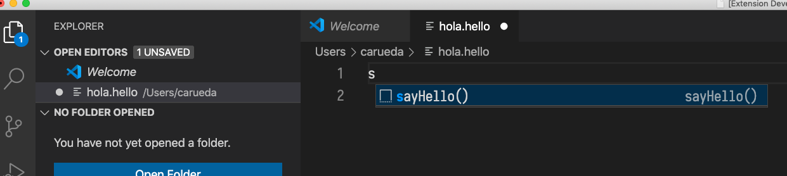

Complete HelloFalks example from article "Implementing a Language Server… How Hard Can It Be?"
by Nipuna Marcus (thanks!),
in particular
[Part 2](https://medium.com/ballerina-techblog/implementing-a-language-server-how-hard-can-it-be-part-2-fa65a741aa23)
for the server component (with code cloned from [here](https://github.com/NipunaMarcus/hellols)),
and 
[Part 3](https://medium.com/ballerina-techblog/implementing-a-language-server-how-hard-can-it-be-part-3-7269962498ac)
for the VS Code extension part (with code cloned from [here](https://github.com/NipunaMarcus/helloFalks)).

It all worked as explained with just a couple of very minor adjustments (like path to the jar).

Build server:

    (cd hellols && mvn clean install)

Test VS Code plugin:

      cd helloFalks
      code .

      F5

